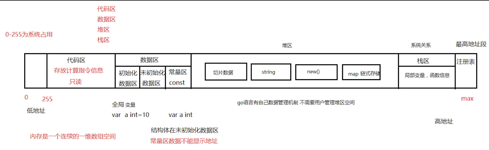
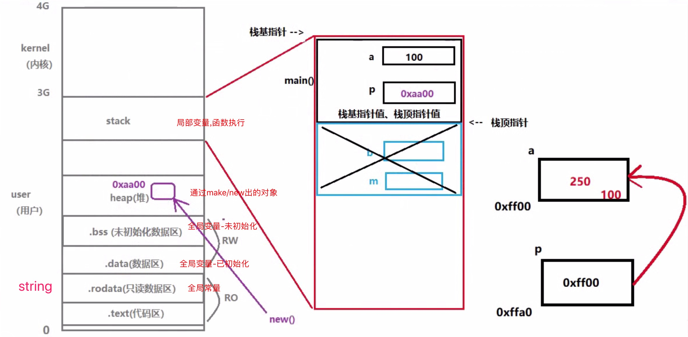
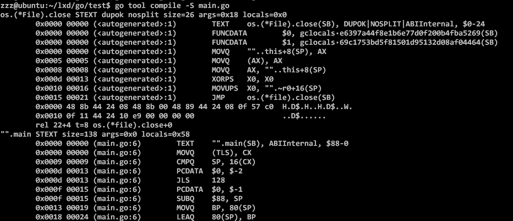

---------------------

##### 要点:

1.虚拟机内存是**连续的一维数组**。

2.虚拟机内存被划分为(1)栈区，局部变量，函数信息;(2)堆区，go自己GC管理堆空间。

3.数据区 .data rw//全局变量(已初始化); .bass rw //全局变量(未初始化) .rodata ro //全局变量，常量数据不能显示地址

4.代码区 .text ro

```shell
go build -h usage: go build [-o output] [-i] -[bulid flags] [package]
```

**-v** 打印出那些被编译的代码包的名字; **-p n** 开启并发编译，默认情况下该值为CPU逻辑核数; **-a** 强制重新构建; -n 打印编译时会用到的所有命令，但不真正执行;**-x** 打印编译时会用到的所有命令; **-race** 开启竞态检测; **-work** 打印出编译时生成的临时工作目录的路径。并在编译结束时保留它。它默认编译结束时被删除。

//分三步：

1. /usr/local/go/pkg/tool/linux_amd64/compile

2.  /usr/local/go/pkg/tool/linux_amd64/buildid

3.  /usr.local/go/pkg/tool/linux_amd64/link

   ---------------------------

   

```shell
go tool compile -S main.go
```

//输出FUNCDATA和PCDATA时编译器产生的，用于保存一些和垃圾手机相关的信息。



```shell
go build -gcflags '-N -l'
```

//禁止GC优化和内联， -gcflags 用于特定需要传递给 go tool compile 命令的标记列表。 -m print optimization decisions;  -N disable optimizations; -l disable inlining(禁止内联，禁止内联也可以一定程度上减小可执行程序的大小)

```shell
go tool compile --help
```

//查看 gcflags 参数含义

```shell
go build -gcflags '-N -l' main.go
```

//逃逸分析